# Technical Solution Design - CrossAI Flexible Input Version

## Adaptive Architecture - Multi-Modal Intelligence

```mermaid
graph TB
    subgraph "Flexible Input Layer"
        A[Universal Interface] --> B[Input Type Detector]
        B --> C[Keyword-First Path]
        B --> D[Image-First Path]
        B --> E[Hybrid Path]
        
        C --> C1[Text Preprocessor]
        C --> C2[NLP Semantic Analyzer]
        C --> C3[Intent Classifier]
        
        D --> D1[Image Upload Handler]
        D --> D2[Visual Intelligence Engine]
        D --> D3[Quality Assessor]
        
        E --> E1[Multimodal Fusion]
        E --> E2[Conflict Resolver]
        E --> E3[Complementary Analysis]
    end

    subgraph "Adaptive Workflow Engine"
        F[Workflow Orchestrator] --> G[Mode Selector]
        F --> H[Resource Manager]
        F --> I[Preference Learner]
        
        G --> G1[Automatic Detection]
        G --> G2[Manual Override]
        G --> G3[Comparison Mode]
        
        H --> H1[Model Pre-caching]
        H --> H2[Load Balancing]
        H --> H3[Cost Optimization]
        
        I --> I1[User Profile Builder]
        I --> I2[Success Pattern Recognition]
        I --> I3[Proactive Recommendations]
    end

    subgraph "Unified Content Generation"
        J[Content Generator] --> K[Text Generation Engine]
        J --> L[Image Generation Engine]
        J --> M[Platform Adapter]
        
        K --> K1[SEO Optimizer]
        K --> K2[Tone Customizer]
        K --> K3[Keyword Strategist]
        
        L --> L1[Style Transfer]
        L --> L2[Composition Engine]
        L --> L3[Quality Enhancer]
        
        M --> M1[Amazon Formatter]
        M --> M2[eBay Optimizer]
        M --> M3[Shopify Adapter]
    end

    subgraph "Intelligent Optimization"
        N[Optimization Engine] --> O[A/B Test Manager]
        N --> P[Performance Analyzer]
        N --> Q[Market Adaptor]
        
        O --> O1[Variant Generator]
        O --> O2[Winner Promotion]
        
        P --> P1[Conversion Predictor]
        P --> P2[Success Metrics]
        
        Q --> Q1[Cultural Localizer]
        Q --> Q2[Seasonal Adjuster]
    end

    subgraph "Universal Asset Management"
        R[Asset Library] --> S[Smart Tagging]
        R --> T[Usage Analytics]
        R --> U[Cross-Platform Sync]
        
        S --> S1[Auto-categorization]
        S --> S2[Similarity Search]
        
        T --> T1[Performance Tracking]
        T --> T2[Cost Analysis]
        
        U --> U1[Format Converter]
        U --> U2[Platform Optimizer]
    end

    subgraph "Learning & Intelligence"
        V[Learning System] --> W[Feedback Processor]
        V --> X[Pattern Recognizer]
        V --> Y[Prediction Engine]
        
        W --> W1[User Action Logger]
        W --> W2[Satisfaction Predictor]
        
        X --> X1[Success Pattern Mining]
        X --> X2[Failure Analysis]
        
        Y --> Y1[Trend Forecaster]
        Y --> Y2[Recommendation Generator]
    end

    %% Data Flows
    A --> F
    F --> J
    J --> N
    N --> R
    R --> V
    V --> F
    
    %% Mode-specific flows
    C --> J
    D --> J
    E --> J
```



## Core Adaptive Algorithms

### 1. Intelligent Input Detection
```python
class InputTypeDetector:
    def detect_input_mode(self, input_data):
        # Text-heavy detection
        if self.is_text_dominant(input_data):
            if self.contains_keywords_only(input_data):
                return "keyword_first"
            elif self.contains_detailed_descriptions(input_data):
                return "enhanced_text"
        
        # Image-heavy detection  
        elif self.is_image_dominant(input_data):
            if self.has_single_image(input_data):
                return "image_first"
            elif self.has_multiple_images(input_data):
                return "comparative_image"
        
        # Mixed detection
        elif self.has_both_modalities(input_data):
            return "hybrid_intelligence"
        
        # Fallback to user preference
        return self.get_user_preferred_mode()
    
    def get_optimal_workflow(self, input_mode, user_context):
        workflows = {
            "keyword_first": self.build_text_workflow(user_context),
            "image_first": self.build_visual_workflow(user_context),
            "hybrid_intelligence": self.build_fusion_workflow(user_context)
        }
        return workflows.get(input_mode, workflows["keyword_first"])
```

### 2. Multimodal Fusion Engine
```python
class MultimodalFusionEngine:
    def fuse_inputs(self, text_data, image_data, user_preferences):
        # Extract semantic representations
        text_embeddings = self.nlp_model.encode(text_data)
        image_embeddings = self.vision_model.encode(image_data)
        
        # Find alignment and conflicts
        alignment_score = self.calculate_alignment(text_embeddings, image_embeddings)
        conflicts = self.detect_conflicts(text_data, image_data)
        
        # Generate fusion strategy
        if alignment_score > 0.8:
            strategy = "reinforcement"  # Both sources agree
        elif alignment_score > 0.5:
            strategy = "complementation"  # Sources add different value
        else:
            strategy = "resolution_required"  # Conflicts need resolution
        
        # Execute fusion
        fused_content = self.execute_fusion_strategy(
            strategy, text_data, image_data, conflicts
        )
        
        return {
            "fused_content": fused_content,
            "confidence_score": alignment_score,
            "conflicts_resolved": len(conflicts),
            "fusion_strategy": strategy
        }
```

### 3. Adaptive Learning System
```python
class AdaptiveLearner:
    def update_user_profile(self, user_id, interaction_data):
        profile = self.get_user_profile(user_id)
        
        # Track mode preferences
        profile["preferred_modes"][interaction_data["mode"]] += 1
        
        # Learn success patterns
        if interaction_data["outcome"] == "positive":
            pattern = self.extract_pattern(interaction_data)
            profile["success_patterns"].append(pattern)
        
        # Update efficiency metrics
        profile["efficiency_scores"][interaction_data["mode"]] = \
            self.calculate_efficiency(interaction_data)
        
        # Predict next best action
        next_recommendation = self.predict_next_best_action(profile)
        
        return profile, next_recommendation
```

## Database Schema - Flexible Model

### Core Tables
```sql
-- 用户偏好表 (学习用户习惯)
CREATE TABLE user_preferences (
    id BIGINT PRIMARY KEY AUTO_INCREMENT,
    user_id BIGINT NOT NULL,
    preferred_input_modes JSON, -- 各场景下偏好的输入模式
    mode_effectiveness_scores JSON, -- 不同模式的成功率
    workflow_customizations JSON, -- 个性化工作流设置
    learning_interactions INT DEFAULT 0,
    last_mode_switch TIMESTAMP,
    created_at TIMESTAMP DEFAULT CURRENT_TIMESTAMP,
    updated_at TIMESTAMP DEFAULT CURRENT_TIMESTAMP ON UPDATE CURRENT_TIMESTAMP
);

-- 灵活输入记录表
CREATE TABLE flexible_inputs (
    id BIGINT PRIMARY KEY AUTO_INCREMENT,
    user_id BIGINT NOT NULL,
    input_mode ENUM('keyword_first', 'image_first', 'hybrid_intelligence'),
    input_data JSON, -- 原始输入数据
    detected_intent JSON, -- 系统识别的用户意图
    selected_workflow JSON, -- 选择的工作流
    processing_time_ms INT,
    user_satisfaction_score DECIMAL(2,1),
    created_at TIMESTAMP DEFAULT CURRENT_TIMESTAMP
);

-- 多模态内容表
CREATE TABLE multimodal_content (
    id BIGINT PRIMARY KEY AUTO_INCREMENT,
    input_id BIGINT NOT NULL,
    content_type ENUM('text_only', 'image_only', 'mixed'),
    generated_title VARCHAR(500),
    generated_bullets JSON,
    generated_description TEXT,
    generated_keywords JSON,
    image_assets JSON, -- 关联的图像资产
    platform_variants JSON, -- 各平台变体
    optimization_history JSON, -- 优化历程
    performance_metrics JSON, -- 表现数据
    created_at TIMESTAMP DEFAULT CURRENT_TIMESTAMP,
    FOREIGN KEY (input_id) REFERENCES flexible_inputs(id)
);

-- 模式对比表 (用于A/B测试)
CREATE TABLE mode_comparisons (
    id BIGINT PRIMARY KEY AUTO_INCREMENT,
    product_concept VARCHAR(255),
    mode_a_results JSON,
    mode_b_results JSON,
    winner_mode VARCHAR(50),
    comparison_metrics JSON,
    user_decision VARCHAR(50),
    created_at TIMESTAMP DEFAULT CURRENT_TIMESTAMP
);
```

## API Design - Flexible Interface

### Universal Input API
```http
# 智能输入处理 (自动检测模式)
POST /api/flexible/process
Content-Type: multipart/form-data
Authorization: Bearer {jwt_token}

--form 'input_type="auto"'  # auto, text, image, hybrid
--form 'text_data="wireless headphones with noise canceling"'
--form 'images[]=@product.jpg'
--form 'target_platforms=["amazon", "ebay"]'
--form 'workflow_preferences={"mode_override": null, "optimization_level": "standard"}'

Response:
{
  "detected_mode": "hybrid_intelligence",
  "selected_workflow": "multimodal_fusion",
  "processing_summary": {
    "input_analysis": {
      "text_confidence": 0.95,
      "image_confidence": 0.88,
      "fusion_strategy": "complementation"
    },
    "execution_time_ms": 45230,
    "resources_used": {
      "text_tokens": 1250,
      "image_processing_units": 3,
      "generation_calls": 2
    }
  },
  "results": {
    "primary_content": {
      "title": "Premium Wireless Headphones with Active Noise Canceling",
      "bullets": ["Advanced noise cancellation technology...", "..."],
      "description": "...",
      "keywords": ["wireless", "bluetooth", "noise-canceling", "premium"]
    },
    "image_results": {
      "analyzed_attributes": {"color": "black", "style": "professional"},
      "generated_variants": ["lifestyle", "studio", "action"]
    },
    "platform_optimizations": {
      "amazon": {"format": "enhanced", "image_count": 3},
      "ebay": {"format": "standard", "image_count": 1}
    }
  },
  "alternatives": {
    "text_only_result": {"preview": "...", "performance_prediction": 0.82},
    "image_only_result": {"preview": "...", "performance_prediction": 0.79}
  },
  "next_suggestions": [
    {
      "action": "generate_variants",
      "description": "Create lifestyle and professional versions",
      "estimated_time": "30 seconds"
    },
    {
      "action": "optimize_for_season",
      "description": "Adapt content for upcoming holiday season",
      "estimated_time": "15 seconds"
    }
  ]
}
```

### Manual Mode Selection API
```http
# 手动选择工作流模式
POST /api/flexible/process/manual
Content-Type: application/json
Authorization: Bearer {jwt_token}

{
  "input_data": {
    "text": "ergonomic office chair with lumbar support",
    "images": []  // 或提供图片URLs
  },
  "forced_mode": "keyword_first",  // keyword_first, image_first, hybrid_intelligence
  "customization": {
    "tone": "professional",
    "target_audience": "office_workers",
    "priority_platforms": ["amazon"]
  }
}
```

### Mode Comparison API
```http
# 对比不同模式的结果
POST /api/flexible/compare-modes
Content-Type: application/json
Authorization: Bearer {jwt_token}

{
  "input_data": {
    "text": "vintage leather messenger bag",
    "images": ["bag_photo.jpg"]
  },
  "modes_to_compare": ["keyword_first", "image_first", "hybrid_intelligence"],
  "comparison_metrics": ["quality_score", "processing_time", "predicted_conversion"]
}

Response:
{
  "comparison_results": [
    {
      "mode": "keyword_first",
      "processing_time_ms": 28400,
      "quality_score": 0.84,
      "predicted_conversion": 0.067,
      "content_preview": "..."
    },
    {
      "mode": "image_first", 
      "processing_time_ms": 41200,
      "quality_score": 0.91,
      "predicted_conversion": 0.073,
      "content_preview": "..."
    },
    {
      "mode": "hybrid_intelligence",
      "processing_time_ms": 55600,
      "quality_score": 0.94,
      "predicted_conversion": 0.078,
      "content_preview": "..."
    }
  ],
  "recommendation": "hybrid_intelligence",
  "reasoning": "Highest quality and conversion prediction with acceptable time cost"
}
```

## Processing Pipelines

### Keyword-First Pipeline
```mermaid
sequenceDiagram
    participant U as User
    participant S as System
    participant N as NLP Engine
    participant G as Generator
    O as Optimizer
    
    U->>S: Submit keywords/text
    S->>N: Semantic analysis
    N->>N: Intent classification
    N->>N: Entity extraction
    N->>G: Structured input
    G->>G: Generate content variants
    G->>O: Initial content
    O->>O: SEO optimization
    O->>O: Platform adaptation
    O->>S: Final content
    S->>U: Deliver results
```

### Image-First Pipeline
```mermaid
sequenceDiagram
    participant U as User
    participant S as System
    participant V as Vision Engine
    participant A as Analyzer
    G as Generator
    O as Optimizer
    
    U->>S: Upload images
    S->>V: Deep visual analysis
    V->>A: Extract attributes
    A->>A: Scene understanding
    A->>A: Quality assessment
    A->>G: Visual intelligence
    G->>G: Generate complementary text
    G->>O: Content with images
    O->>O: Visual-text optimization
    O->>S: Optimized listing
    S->>U: Deliver results
```

### Hybrid Intelligence Pipeline
```mermaid
sequenceDiagram
    participant U as User
    participant S as System
    participant F as Fusion Engine
    V as Vision Engine
    N as NLP Engine
    G as Generator
    O as Optimizer
    
    U->>S: Provide text + images
    par Parallel Analysis
        S->>V: Image analysis
        S->>N: Text analysis
    end
    V->>F: Visual insights
    N->>F: Text insights
    F->>F: Conflict resolution
    F->>F: Complementary fusion
    F->>G: Enriched context
    G->>G: Generate enhanced content
    G->>O: Multi-modal content
    O->>S: Final optimized result
    S->>U: Deliver fusion results
```

## Technology Stack - Flexible Architecture

### Core AI Models
- **Text Processing**: GPT-4 Turbo + Claude 3.5 Sonnet
- **Image Analysis**: GPT-4 Vision + CLIP + DINOv2
- **Image Generation**: DALL-E 3 + Stable Diffusion XL + Midjourney
- **Multimodal Fusion**: Custom transformer architecture
- **Intent Classification**: Fine-tuned BERT models

### Backend Services
- **Framework**: Spring Boot 3.2.x with reactive programming
- **Database**: PostgreSQL 15+ (JSONB for flexibility) + Redis Cluster
- **Message Queue**: Apache Kafka for async processing
- **Vector Search**: Pinecone for similarity matching
- **Analytics**: Apache Flink for real-time processing

### Frontend Experience
- **Framework**: Vue 3.4.x with Composition API
- **UI Components**: Headless UI + Tailwind CSS
- **State Management**: Pinia with optimistic updates
- **Real-time**: WebSocket for live progress updates
- **Mobile**: PWA with camera integration

### Deployment Architecture
- **Container**: Docker + Kubernetes orchestration
- **Cloud**: 阿里云 + AWS multi-region deployment
- **CDN**: Global edge network for image delivery
- **Monitoring**: Custom metrics + Prometheus + Grafana
- **MLOps**: MLflow for model lifecycle management

## Implementation Roadmap

### Phase 1: Foundation (Months 1-2)
- Universal input detection system
- Basic keyword-first and image-first pipelines
- Core database schema and APIs
- User preference learning foundation

### Phase 2: Advanced Fusion (Months 3-4)
- Multimodal fusion engine
- Hybrid intelligence workflows
- Advanced optimization algorithms
- A/B testing framework

### Phase 3: Adaptive Intelligence (Months 5-6)
- Sophisticated learning systems
- Proactive recommendation engine
- Cross-mode comparison tools
- Advanced analytics dashboard

### Phase 4: Market Optimization (Months 7-8)
- Industry-specific adaptations
- Partnership integrations
- Performance optimization
- Scale testing and refinement

## Success Metrics

### Flexibility KPIs
- **Mode Detection Accuracy**: >99% correct automatic detection
- **Switching Speed**: <2 seconds between modes
- **User Satisfaction**: >4.6/5 for flexibility options
- **Feature Adoption**: >70% users try multiple modes

### Performance Standards
- **Keyword Mode**: <30s average processing time
- **Image Mode**: <45s average processing time  
- **Hybrid Mode**: <60s average processing time
- **Accuracy**: >95% content relevance across all modes

### Business Impact
- **Conversion Lift**: 10-25% improvement over single-mode systems
- **User Retention**: >85% monthly active users
- **Time Savings**: 50-70% reduction in listing creation time
- **Revenue Per User**: 30-50% increase through better optimization

---

**Strategic Advantage**: CrossAI's flexible architecture addresses the diverse needs of modern e-commerce sellers, allowing each user to work in their most natural way while benefiting from AI enhancement. The system learns and adapts, becoming more valuable with every interaction.